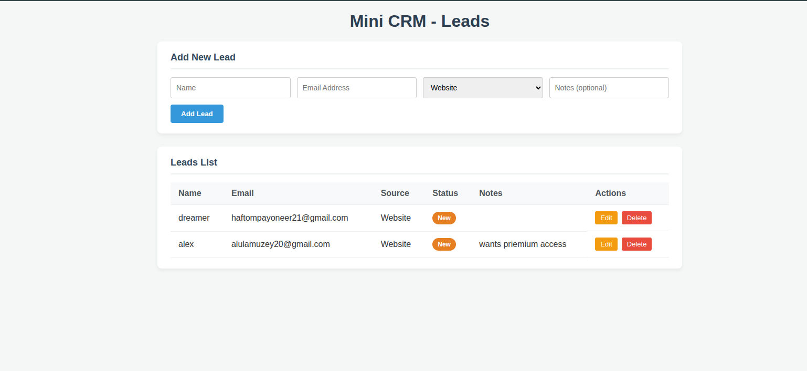

# Future Interns Task 2: Mini CRM

<!-- IMPORTANT: Save the screenshot you shared as "screenshot.png" in this main folder so this image works! -->


## Overview
This is a Full-Stack Mini CRM built with Node.js, Express, MySQL, and React (Vite). It allows users to securely capture, track, and manage a list of leads using a responsive, modern user interface.

## Features
- **Add New Leads:** Create new leads with details like Name, Email, Source, and Notes.
- **Leads List Database:** View all stored leads dynamically presented in a professional table.
- **Update & Delete:** Modify existing leads or remove them completely from the system.
- **Status Tracking:** Color-coded status badges for quick visual identification.

## Tech Stack
- **Frontend:** React, Vite, Custom CSS
- **Backend:** Node.js, Express
- **Database:** MySQL
- **HTTP Client:** Axios

## How to Run Locally

### 1. Database Setup
Create a MySQL database named `mini_crm` and execute the SQL query inside `/server/schema.sql` to initialize the `leads` table.

### 2. Start the Backend (Server)
Navigate to the `server` folder, update your MySQL credentials in the `.env` file, install dependencies, and start the Express server:
```bash
cd server
npm install
node server.js
```

### 3. Start the Frontend (Client)
In a new terminal window, navigate to the `client` folder to start the React UI application:
```bash
cd client
npm install
npm run dev
```

Navigate to the localhost port provided by Vite (e.g., `http://localhost:5174`) in your browser to use the Mini CRM!
